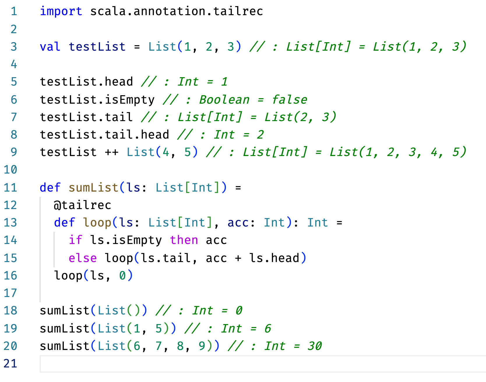
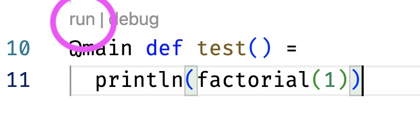

# sbt project compiled with Scala 3

This contains the basic sbt configuration needed to run Scala 3 code.

## Installation

1. check that you have the "Scala (Metals)" and "Scala Syntax (official)" extensions installed in VSCode,
1. _disable_ the "[TEMPORARY] Dotty Indentation Syntax" extension,
1. clone this repo: `git clone git@gitlab.epfl.ch:lamp/cs210-worksheets.git` (if you already cloned it before, remove it and clone it again),
1. open it with VSCode (`code .`),
1. click on "Import SBT Build":
  
1. wait while Metals runs `bloopInstal`:
  

## Usage

### Scala worksheets

Inside `src/main/scala`, you can create Scala _worksheets_ (files ending with `.worksheet.sc`). These are special Scala files meant for experimentation where the result of every top-level expression is directly displayed in the IDE. See [the official tutorial about Scala worksheets](https://docs.scala-lang.org/scala3/book/tools-worksheets.html) for more details.

We provide [`sumList.worksheet.sc`](src/main/scala/sumList.worksheet.sc) as an example. If you open it in VSCode, you should see the result of all top-level expressions automatically displayed:



Try to change the code and you should see the results automatically updating!

### Normal Scala files

If you prefer, you can also create “normal” Scala files (ending with `.scala`) and excute their `@main` methods.

[`factorial.scala`](src/main/scala/factorial.scala) is provided as an example. You can run it from the command-line, first by entering the sbt shell:

```bash
sbt
```
and then by running the `run` sbt command:

```bash
run src/main/scala/factorial.scala
```

which should output something similar to:

```
sbt:cs210-worksheets> run src/main/scala/factorial.scala
[info] compiling 1 Scala source to .../cs210-worksheets/target/scala-3.0.2/classes ...
[info] running test src/main/scala/factorial.scala
1
[success] Total time: 0 s, completed 29 Sep 2021, 18:32:37
```

You can also directly run it from VSCode using the `run` link:


